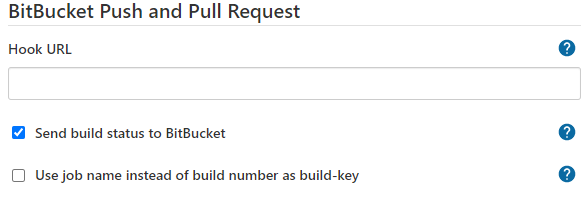
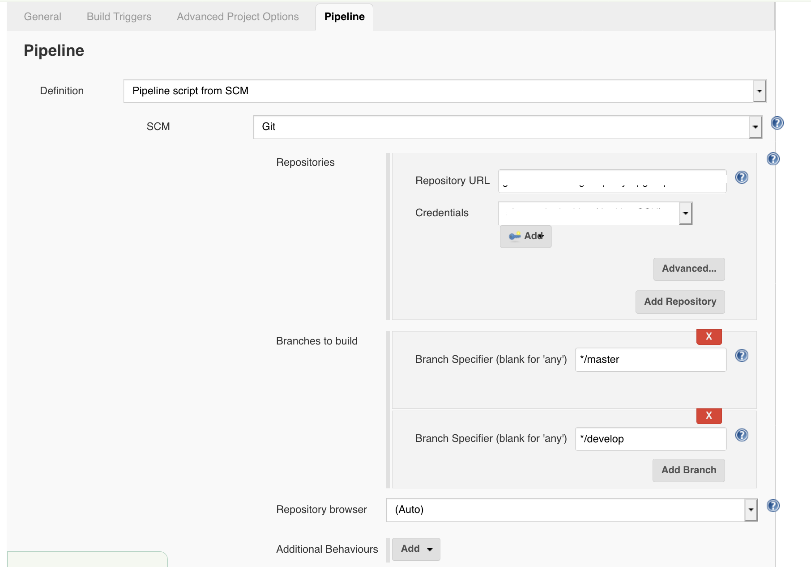
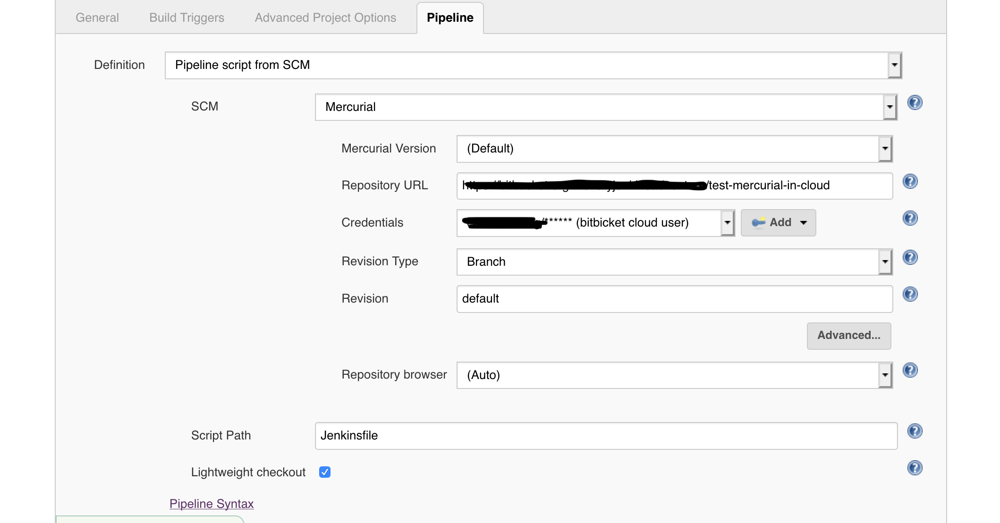
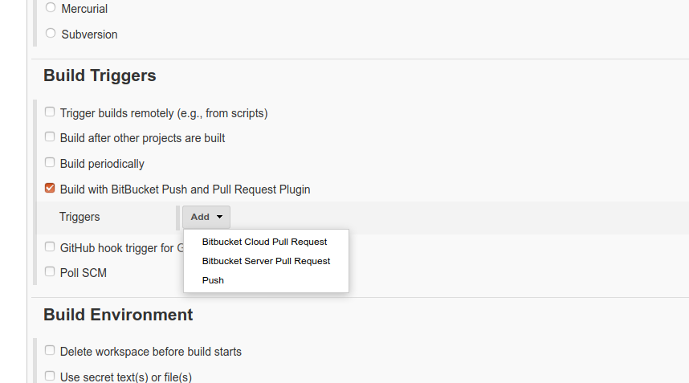
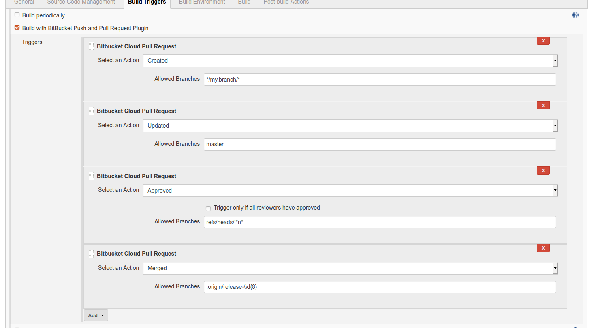
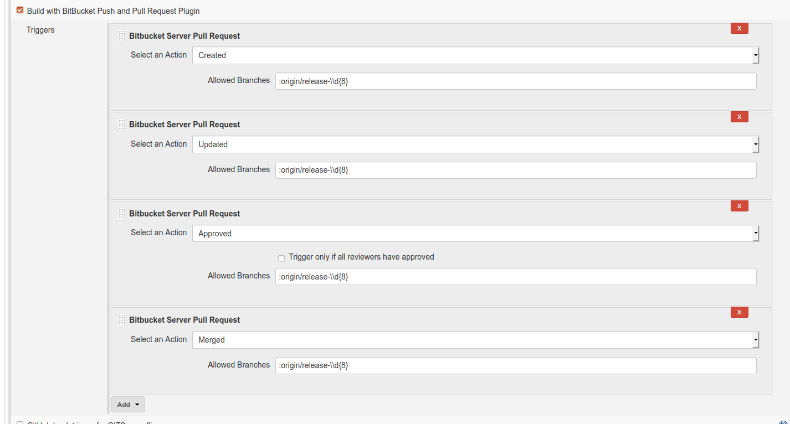
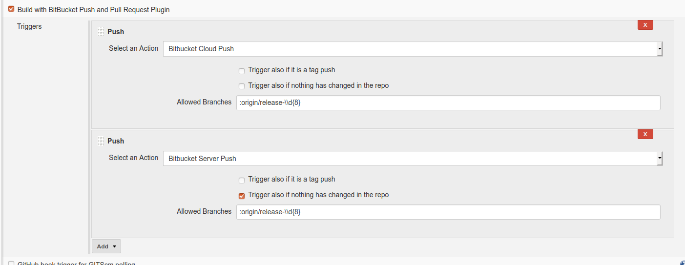

# Bitbucket Push and Pull Request Plugin

[](https://ci.jenkins.io/job/Plugins/job/bitbucket-push-and-pull-request-plugin/job/master/)
[](https://github.com/jenkinsci/bitbucket-push-and-pull-request-plugin/graphs/contributors)
[](https://plugins.jenkins.io/bitbucket-push-and-pull-request)
[](https://github.com/jenkinsci/bitbucket-push-and-pull-request-plugin/releases/latest)
[](https://plugins.jenkins.io/bitbucket-push-and-pull-request)
[](https://gitter.im/jenkinsci/bitbucket-push-and-pull-request-plugin)


- [Bitbucket Push and Pull Request Plugin](#bitbucket-push-and-pull-request-plugin)
- [Introduction](#introduction)
- [Before you start](#before-you-start)
- [Configuration](#configuration)
  - [Configure the webhook](#configure-the-webhook)
    - [Configure the Global Configurations of the Plugin](#configure-the-global-configurations-of-the-plugin)
  - [Configure your Jenkins job](#configure-your-jenkins-job)
    - [Authentication for state notification and generally when using the Bitbucket REST API](#authentication-for-state-notification-and-generally-when-using-the-bitbucket-rest-api)
  - [Bitbucket Events supported by the plugin](#bitbucket-events-supported-by-the-plugin)
    - [Some examples](#some-examples)
- [Troubleshooting: Some important aspects to keep in mind](#troubleshooting-some-important-aspects-to-keep-in-mind)
    - [About the initialization of the plugin](#about-the-initialization-of-the-plugin)
    - [About the filters on the branches](#about-the-filters-on-the-branches)
    - [About the build state propagation and the approve set by Jenkins on BitBucket](#about-the-build-state-propagation-and-the-approve-set-by-jenkins-on-bitbucket)
- [Environment variables](#environment-variables)
- [Dsl Job actions for Bitbucket Push and Pull Request Trigger](#dsl-job-actions-for-bitbucket-push-and-pull-request-trigger)
- [Dsl Job snippets](#dsl-job-snippets)
    - [Valid for freestyle jobs and pipeline jobs (until job-dsl plugin v1.76, deprecated in v1.77 for pipeline jobs)](#valid-for-freestyle-jobs-and-pipeline-jobs-until-job-dsl-plugin-v176-deprecated-in-v177-for-pipeline-jobs)
    - [Valid for pipeline with job-dsl 1.77+ (and before)](#valid-for-pipeline-with-job-dsl-177-and-before)
    - [Second (more verbose) valid dsl for freestyle jobs](#second-more-verbose-valid-dsl-for-freestyle-jobs)
- [Pipeline script](#pipeline-script)
- [Thanks and Acknowledgments](#thanks-and-acknowledgments)


# Introduction

Plugin for Jenkins **v2.138.2 or later**, that triggers builds on Bitbucket's push and pull requests events.

The new features introduced by Bitbucket Push and Pull Request 2.x.x are:

- build state notification
- support of pull requests for Bitbucket cloud (rest api v2.x+ with mercurial and git) and bitbucket Server (5.14+ with git)
- support of pushs for Bitbucket cloud (rest api v2.x+ with mercurial and git) and Bitbucket server (5.14+ with git)
- usage of Gson instead of net.sf.json.JSONObject
- Introduction of models and major security improvements

Bitbucket Push and Pull Request supports the

- Bitbucket cloud rest api v2.x+ and later (with git and mercurial repos)
- Bitbucket server 5.14+ and later (with git repos)

 # Before you start

Bitbucket Push And Pull Request Plugin will not work if the old Bitbucket plugin <https://plugins.jenkins.io/bitbucket> is still installed. So, please de-install from Jenkins the previous Bitbucket plugin if you want to use this new one.

Reason is: both plugins use the same webhook endpoint and Jenkins gives priority to the old Bitbucket plugin, due to the lexical ordering used by Stapler to dispatch the request.

In case you want to use both plugins on the same Jenkins instance, you must:

- override the default webhook endpoint "bitbucket-hook" in the Jenkins Global Configurations of the Bitbucket Push and Pull Request Plugin using a fresh new webhook - let's say: "bitbucket-ppr-webhook". **This webhook has to be a new one, consumed only by the Bitbucket Push and Pull Request Plugin, in order to avoid conflicts with other plugins**
- After that, restart Jenkins
- and configure the Bitbucket Cloud / Server webhooks accordingly to the new webhook endpoint (in our example: "bitbucket-ppr-webhook")

# Configuration

## Configure the webhook

Configure your Bitbucket repository adding a webhook in the settings page. In the URL field (see image, at point A) add your JENKINS_URL followed by "/bitbucket-hook/" (for example <https://my-jenkins.on-my-planet-far-away.com/bitbucket-hook/>) Credentials for the webhook endpoint are not required, the trailing slash is mandatory.

For more specific infos about managing webhooks please consult:

- <https://confluence.atlassian.com/bitbucket/manage-webhooks-735643732.html>. (Bitbucket Cloud)
- <https://confluence.atlassian.com/bitbucketserver/managing-webhooks-in-bitbucket-server-938025878.html>. (Bitbucket Server)

### Configure the Global Configurations of the Plugin

in the __Jenkins Global Configurations__: 

1. you can override the default webhook endpoint "/bitbucket-hook/" consumed by the plugin

2. you can disable the build status notifications propagation.

3. you can choose what build key to use for build status propagation

4. you can set global credentials used by the plugin for the state notification



## Configure your Jenkins job

1. Configure the Bitbucket Repository under the Source Code Management with your credentials. For git:

In case you are using Mercurial instead of git, configure it as follows:

_Please note: the branch, related to the events which trigger the builds, must be specified in the field Revision._

2. Now activate the plugin in your job selecting the "Build with Bitbucket Push and Pull Request Plugin" option in the Build Triggers pane.

### Authentication for state notification and generally when using the Bitbucket REST API

TYPE | BB CLOUD | BB SERVER | JENKINS CREDENTIALS | NOTES
--- | :-- | :---  | :--- | ---
Username & Password | X | X | Username with password| deprecated by bbc, will be removed in march 2022
HTTP access token | - | X | Secret Text | [learn more about HTTP tokens](https://confluence.atlassian.com/bitbucketserver/http-access-tokens-939515499.html)
OAuth consumers  | X | - | Secret Text | [learn more about Oauth Consumers](https://support.atlassian.com/bitbucket-cloud/docs/use-oauth-on-bitbucket-cloud/)

1. you can set globally the credentials used by the plugin for the state notification
2. you can set for each job the credentials used by the plugin for the state notification, overwriting the global credentials
3. you you don't set nothing the plugin will try to use the credentials used by the git plugin

## Bitbucket Events supported by the plugin

FILTER | BB CLOUD | BB SERVER | NOTES
--- | :-- | :---  | ---
Pull Request Created | X | X |
Pull Request Updated | X | X |
Pull Request Declined | X | X |
Pull Request Merged | X | X |
Push | X | X |
Comment Created | X | X |
Comment Updated | X | - | If a user updates the same comment with not much time in between, Bitbucket only sends the event request the first time the comment is updated.
Comment Deleted | X | - |

### Some examples







# Troubleshooting: Some important aspects to keep in mind

### About the initialization of the plugin

The Bitbucket Push and Pull Request Plugin (**BBPPR Plugin**) uses the **Git Plugin** to handle with the git repositories managed by BitBucket. More in details:

1. The user initiliazes a new job starting manually a build.
2. The **Git Plugin** clones the repository declared in the job fetching the branches as defined in the **Branch Specifier** filter field.
3. Due to the fact that each branch is new, the **BBPPR Plugin** *sees* everywhere changes and, as a consequence, the **BBPPR Plugin** starts for each new fetched branch a job.
4. It's also important to keep in mind that the filters on the branches specified by the **BBPPR Plugin** in its **Allowed Branches** field, are not applied in the initialization phase, because they are only active for jobs triggered through the BitBucket webhook (and not for the ones, which are built manually).

### About the filters on the branches

Talking generally, there are two filters used to 'control the branches':

- the **Git plugin** filter on the branches: a kind of general filter applied at job level.
- the **BBPPR plugin** filter: a specific one, that acts at trigger level and that is there because the user can have in a job more triggers than only one.

- Important is to keep in mind, that you cannot trigger events on branches that are excluded from the Git Plugin filter. It has the precedence because it defines (fetches) the branches, that can be accessed by the **BBPPR plugin**.

- Moreover, the way in which the matching is done is the same for both plugins, because **we are using for the matching the public method given to disposal from the Git Plugin**.
The reason for that is the wish to guarantee consistency between the two plugins, at least regarding the way in which branches are matched. This all means also, that we are not implementing the matching logic.

- As you see from the code: `return matches(allowedBranches, bitbucketAction.getTargetBranch(), null);`, the matching is between the string you specified (`allowedBranches`) and the **target branch** specified in the payload sent from BitBucket (`bitbucketAction.getTargetBranch()`). This means that **The filter is not on the source branch, but on the target branch.**

- You can find al lot of examples in this test class: [BitBucketPPRPullRequestCreatedActionFilterTest.java](https://github.com/jenkinsci/bitbucket-push-and-pull-request-plugin/blob/master/src/test/java/io/jenkins/plugins/bitbucketpushandpullrequest/filter/pullrequest/cloud/BitBucketPPRPullRequestCreatedActionFilterTest.java)


# Environment variables

NAME | VALUE | SCOPE | BB TYPE | NOTES
--- | :-- | :--- | :--- | ---
BITBUCKET_TARGET_BRANCH | target branch | PR + P | C + S |
BITBUCKET_ACTOR | actor name | PR + P | C + S |
BITBUCKET_PAYLOAD | Complete payload as json string | PR + P | C + S |
BITBUCKET_X_EVENT | x-event which triggered the plugin | PR + P | C + S |
BITBUCKET_SOURCE_BRANCH | source branch | PR | C + S |
BITBUCKET_PULL_REQUEST_TITLE | PR title | PR | C + S |
BITBUCKET_PULL_REQUEST_ID | id | PR | C + S |
BITBUCKET_PULL_REQUEST_LINK | link | PR | C + S |
BITBUCKET_PULL_REQUEST_DESCRIPTION | PR description | PR | C + S |
BITBUCKET_PULL_REQUEST_COMMENT_TEXT | Comment of BB Cloud Pull Request | PR | C + S |
BITBUCKET_PULL_REQUEST_LATEST_COMMIT_FROM_SOURCE_BRANCH | Latest commit hash on the source branch | PR | C + S | 
BITBUCKET_PULL_REQUEST_LATEST_COMMIT_FROM_TARGET_BRANCH | Latest commit hash on the target branch | PR | C + S | 
BITBUCKET_REPOSITORY_UUID | Repository identifier | P | C |
BITBUCKET_REPOSITORY_ID | Repository identifier | P | S |
BITBUCKET_REPOSITORY_URL | Repository URL | PR | C |
REPOSITORY_LINK | Repository link | P | C | Deprecated: to remove in 2.6
REPOSITORY_NAME | Repository name | P | S | Deprecated: to remove in 2.6

# Dsl Job actions for Bitbucket Push and Pull Request Trigger

```groovy
bitbucketTriggers {

  // For Bitbucket Cloud
  repositoryPushAction(triggerAlsoIfTagPush: boolean, triggerAlsoIfNothingChanged: boolean, allowedBranches: String)
  repositoryPushAction(triggerAlsoIfTagPush: boolean, triggerAlsoIfNothingChanged: boolean, allowedBranches: String, isToApprove: boolean)
  repositoryPushAction(triggerAlsoIfTagPush: boolean, triggerAlsoIfNothingChanged: boolean, allowedBranches: String, isToApprove: boolean, triggerOnlyIfTagPush: boolean)

  pullRequestApprovedAction(onlyIfReviewersApproved: boolean)
  pullRequestApprovedAction(onlyIfReviewersApproved: boolean, allowedBranches: String)
  pullRequestApprovedAction(onlyIfReviewersApproved: boolean, allowedBranches: String, isToApprove: boolean)

  pullRequestCreatedAction()
  pullRequestCreatedAction(allowedBranches: String)
  pullRequestCreatedAction(allowedBranches: String, isToApprove: String)

  pullRequestUpdatedAction()
  pullRequestUpdatedAction(allowedBranches: String)
  pullRequestUpdatedAction(allowedBranches: String, isToApprove: String)

  pullRequestMergedAction()
  pullRequestMergedAction(allowedBranches: String)
  pullRequestMergedAction(allowedBranches: String, isToApprove: String)

  pullRequestDeclinedAction()
  pullRequestDeclinedAction(allowedBranches: String)

  pullRequestCommentCreatedAction()
  pullRequestCommentCreatedAction(allowedBranches: String)
  pullRequestCommentCreatedAction(allowedBranches: String, commentFilter: String) // CommentFilter is java a regex expression

  pullRequestCommentUpdatedAction()
  pullRequestCommentUpdatedAction(allowedBranches: String)
  pullRequestCommentUpdatedAction(allowedBranches: String, commentFilter: String) // CommentFilter is java a regex expression

  pullRequestCommentDeletedAction()
  pullRequestCommentDeletedAction(allowedBranches: String)

  // For Bitbucket Server
  // note: flag `isToApprove` has no effect yet
  repositoryServerPushAction(triggerAlsoIfTagPush: boolean, triggerAlsoIfNothingChanged: boolean, allowedBranches: String)
  repositoryServerPushAction(triggerAlsoIfTagPush: boolean, triggerAlsoIfNothingChanged: boolean, allowedBranches: String, isToApprove: boolean)
  repositoryServerPushAction(triggerAlsoIfTagPush: boolean, triggerAlsoIfNothingChanged: boolean, allowedBranches: String, isToApprove: boolean, triggerOnlyIfTagPush: boolean)

  pullRequestServerApprovedAction(onlyIfReviewersApproved: boolean)
  pullRequestServerApprovedAction(onlyIfReviewersApproved: boolean, allowedBranches: String)
  pullRequestServerApprovedAction(onlyIfReviewersApproved: boolean, allowedBranches: String, isToApprove: boolean)

  pullRequestServerCreatedAction()
  pullRequestServerCreatedAction(allowedBranches: String)
  pullRequestServerCreatedAction(allowedBranches: String, isToApprove: boolean)

  pullRequestServerUpdatedAction()
  pullRequestServerUpdatedAction(allowedBranches: String)
  pullRequestServerUpdatedAction(allowedBranches: String, isToApprove: boolean)

  pullRequestServerSourceUpdatedAction()
  pullRequestServerSourceUpdatedAction(allowedBranches: String)
  pullRequestServerSourceUpdatedAction(allowedBranches: String, isToApprove: boolean)

  pullRequestServerMergedAction()
  pullRequestServerMergedAction(allowedBranches: String)
  pullRequestServerMergedAction(allowedBranches: String, isToApprove: boolean)

  pullRequestServerDeclinedAction()
  pullRequestServerDeclinedAction(allowedBranches: String)

  pullRequestServerCommentCreatedAction()
  pullRequestServerCommentCreatedAction(allowedBranches : String)
  pullRequestServerCommentCreatedAction(allowedBranches : String, commentFilter : String)
}
```

# Dsl Job snippets

### Valid for freestyle jobs and pipeline jobs (until job-dsl plugin v1.76, deprecated in v1.77 for pipeline jobs)

```groovy
// pullRequestCreatedAction()
job('example-pull-request-created') {
  triggers{
    bitbucketTriggers {
      pullRequestCreatedAction()
    }
  }
  scm {
    git {
      remote {
        url("https://git.company.domain/scm/~username/telegram.git")
      }
    }
  }
  steps {
    shell('echo START pull request created')
  }
}

// pullRequestCreatedAction() with filter on branches
job('example-pull-request-created-with-filter-on-branches') {
  triggers{
    bitbucketTriggers {
      pullRequestCreatedAction("master")
    }
  }
  scm {
    git {
      remote {
        url("https://git.company.domain/scm/~username/telegram.git")
      }
    }
  }
  steps {
    shell('echo START pull request created with filter on branches')
  }
}

// pullRequestCreatedAction() with filter on branches
// and eventually approve Pull Request in BB after the job is done
job('example-pull-request-created-with-filter-on-branches-and-is-to-approve') {
  triggers{
    bitbucketTriggers {
      pullRequestCreatedAction("master", true)
    }
  }
  scm {
    git {
      remote {
        url("https://git.company.domain/scm/~username/telegram.git")
      }
    }
  }
  steps {
    shell('echo START pull request created with filter on branches')
  }
}

// pullRequestUpdatedAction()
job('example-pull-request-updated') {
  triggers{
    bitbucketTriggers {
      pullRequestUpdatedAction()
    }
  }
  scm {
    git {
      remote {
        url("https://git.company.domain/scm/~username/telegram.git")
      }
    }
  }
  steps {
    shell('echo START pull request updated')
  }
}

// pullRequestUpdatedAction() wiht filter on branches
job('example-pull-request-updated-with-filter-on-branches') {
  triggers{
    bitbucketTriggers {
      pullRequestUpdatedAction("master")
    }
  }
  scm {
    git {
      remote {
        url("https://git.company.domain/scm/~username/telegram.git")
      }
    }
  }
  steps {
    shell('echo START pull request updated with filter on branches')
  }
}

// pullRequestUpdatedAction() wiht filter on branches
// and eventually approve Pull Request in BB after the job is done
job('example-pull-request-updated-with-filter-on-branches') {
  triggers{
    bitbucketTriggers {
      pullRequestUpdatedAction("master", true)
    }
  }
  scm {
    git {
      remote {
        url("https://git.company.domain/scm/~username/telegram.git")
      }
    }
  }
  steps {
    shell('echo START pull request updated with filter on branches')
  }


// pullRequestApprovedAction(boolean onlyIfReviewersApproved)
job('example-pull-request-approved') {
  triggers{
    bitbucketTriggers {
      pullRequestApprovedAction(false)
    }
  }
  scm {
    git {
      remote {
        url("https://git.company.domain/scm/~username/telegram.git")
      }
    }
  }
  steps {
    shell('echo START pull request approved')
  }
}

// pullRequestApprovedAction(boolean onlyIfReviewersApproved) with filter on branches
job('example-pull-request-approved-with-filter-on-branches') {
  triggers{
    bitbucketTriggers {
      pullRequestApprovedAction(false, "master")
    }
  }
  scm {
    git {
      remote {
        url("https://git.company.domain/scm/~username/telegram.git")
      }
    }
  }
  steps {
    shell('echo START pull request approved with filter on branches')
  }
}


// pullRequestApprovedAction(boolean onlyIfReviewersApproved) with filter on branches
// and eventually approve Pull Request in BB after the job is done
job('example-pull-request-approved-with-filter-on-branches') {
  triggers{
    bitbucketTriggers {
      pullRequestApprovedAction(false, "master", true)
    }
  }
  scm {
    git {
      remote {
        url("https://git.company.domain/scm/~username/telegram.git")
      }
    }
  }
  steps {
    shell('echo START pull request approved with filter on branches')
  }
}

// pullRequestMergedAction()
job('example-pull-request-merged') {
  triggers{
    bitbucketTriggers {
      pullRequestMergedAction()
    }
  }
  scm {
    git {
      remote {
        url("https://git.company.domain/scm/~username/telegram.git")
      }
    }
  }
  steps {
    shell('echo START pull request merged')
  }
}

// pullRequestMergedAction() with filter on branches
job('example-pull-request-merged-with-filter-on-branches') {
  triggers{
    bitbucketTriggers {
      pullRequestMergedAction("master")
    }
  }
  scm {
    git {
      remote {
        url("https://git.company.domain/scm/~username/telegram.git")
      }
    }
  }
  steps {
    shell('echo START pull request merged with filter on branches')
  }
}

// pullRequestMergedAction() with filter on branches
// and eventually approve Pull Request in BB after the job is done
job('example-pull-request-merged-with-filter-on-branches') {
  triggers{
    bitbucketTriggers {
      pullRequestMergedAction("master")
    }
  }
  scm {
    git {
      remote {
        url("https://git.company.domain/scm/~username/telegram.git")
      }
    }
  }
  steps {
    shell('echo START pull request merged with filter on branches')
  }
}

// repositoryPushAction(boolean triggerAlsoIfTagPush, boolean triggerAlsoIfNothingChanged, String allowedBranches)
job('example-push') {
  triggers{
    bitbucketTriggers {
      repositoryPushAction(false, true, "master")
    }
  }
  scm {
    git {
      remote {
        url("https://git.company.domain/scm/~username/telegram.git")
      }
    }
  }
  steps {
      shell('echo START push')
  }
}


// repositoryPushAction(boolean triggerAlsoIfTagPush, boolean triggerAlsoIfNothingChanged, String allowedBranches)
// and eventually approve Pull Request in BB after the job is done
job('example-push') {
  triggers{
    bitbucketTriggers {// and eventually approve Pull Request in BB after the job is done

      repositoryPushAction(false, true, "master", true)
    }
  }
  scm {
    git {
      remote {
        url("https://git.company.domain/scm/~username/telegram.git")
      }
    }
  }
  steps {
      shell('echo START push')
  }
}

// combination of triggers is also possible
job('example-pull-request-created-updated') {
  triggers{
    bitbucketTriggers {
      pullRequestCreatedAction()
      pullRequestUpdatedAction()
      pullRequestMergedAction("master")
    }
  }
  scm {
    git {
      remote {
          url("https://git.company.domain/scm/~username/telegram.git")
      }
    }
  }
  steps {
      shell('echo START pull request created')
  }
}
```

### Valid for pipeline with job-dsl 1.77+ (and before)

Note that this may require an additional script approval, the seed job failing with a message similar to:
```
ERROR: Scripts not permitted to use method groovy.lang.GroovyObject invokeMethod java.lang.String java.lang.Object (javaposse.jobdsl.dsl.jobs.WorkflowJob bitbucketTrigger script$_run_closure1$_closure5$_closure24$_closure29$_closure30$_closure31)
```

```groovy
// pullRequestCreatedAction()
job('example-pull-request-created') {
  properties {
    pipelineTriggers {
      triggers {
        bitBucketTrigger {
          triggers {
            bitBucketPPRPullRequestTriggerFilter {
              actionFilter {
                bitBucketPPRPullRequestCreatedActionFilter {
                }
              }
            }
          }
        }
      }
    }
  }
  scm {
    git {
      remote {
        url("https://git.company.domain/scm/~username/telegram.git")
      }
    }
  }
  steps {
    shell('echo START pull request created')
  }
}

// pullRequestCreatedAction() with filter on branches
job('example-pull-request-created-with-filter-on-branches') {
  properties {
    pipelineTriggers {
      triggers {
        bitBucketTrigger {
          triggers {
            bitBucketPPRPullRequestTriggerFilter {
              actionFilter {
                bitBucketPPRPullRequestCreatedActionFilter {
                  allowedBranches("master")
                }
              }
            }
          }
        }
      }
    }
  }
  scm {
    git {
      remote {
        url("https://git.company.domain/scm/~username/telegram.git")
      }
    }
  }
  steps {
    shell('echo START pull request created with filter on branches')
  }
}

// pullRequestCreatedAction() with filter on branches
// and eventually approve Pull Request in BB after the job is done
job('example-pull-request-created-with-filter-on-branches-and-is-to-approve') {
  properties {
    pipelineTriggers {
      triggers {
        bitBucketTrigger {
          triggers {
            bitBucketPPRPullRequestTriggerFilter {
              actionFilter {
                bitBucketPPRPullRequestCreatedActionFilter {
                  allowedBranches("master")
                  isToApprove(true)
                }
              }
            }
          }
        }
      }
    }
  }
  scm {
    git {
      remote {
        url("https://git.company.domain/scm/~username/telegram.git")
      }
    }
  }
  steps {
    shell('echo START pull request created with filter on branches')
  }
}

// pullRequestUpdatedAction()
job('example-pull-request-updated') {
  properties {
    pipelineTriggers {
      triggers {
        bitBucketTrigger {
          triggers {
            bitBucketPPRPullRequestTriggerFilter {
              actionFilter {
                bitBucketPPRPullRequestUpdatedActionFilter {
                }
              }
            }
          }
        }
      }
    }
  }
  scm {
    git {
      remote {
        url("https://git.company.domain/scm/~username/telegram.git")
      }
    }
  }
  steps {
    shell('echo START pull request updated')
  }
}

// pullRequestUpdatedAction() wiht filter on branches
job('example-pull-request-updated-with-filter-on-branches') {
  properties {
    pipelineTriggers {
      triggers {
        bitBucketTrigger {
          triggers {
            bitBucketPPRPullRequestTriggerFilter {
              actionFilter {
                bitBucketPPRPullRequestUpdatedActionFilter {
                  allowedBranches("master")
                }
              }
            }
          }
        }
      }
    }
  }
  scm {
    git {
      remote {
        url("https://git.company.domain/scm/~username/telegram.git")
      }
    }
  }
  steps {
    shell('echo START pull request updated with filter on branches')
  }
}

// pullRequestUpdatedAction() wiht filter on branches
// and eventually approve Pull Request in BB after the job is done
job('example-pull-request-updated-with-filter-on-branches') {
  properties {
    pipelineTriggers {
      triggers {
        bitBucketTrigger {
          triggers {
            bitBucketPPRPullRequestTriggerFilter {
              actionFilter {
                bitBucketPPRPullRequestUpdatedActionFilter {
                  allowedBranches("master")
                  isToApprove(true)
                }
              }
            }
          }
        }
      }
    }
  }
  scm {
    git {
      remote {
        url("https://git.company.domain/scm/~username/telegram.git")
      }
    }
  }
  steps {
    shell('echo START pull request updated with filter on branches')
  }


// pullRequestApprovedAction(boolean onlyIfReviewersApproved)
job('example-pull-request-approved') {
  properties {
    pipelineTriggers {
      triggers {
        bitBucketTrigger {
          triggers {
            bitBucketPPRPullRequestTriggerFilter {
              actionFilter {
                bitBucketPPRPullRequestApprovedActionFilter {
                  triggerOnlyIfAllReviewersApproved(false)
                }
              }
            }
          }
        }
      }
    }
  }
  scm {
    git {
      remote {
        url("https://git.company.domain/scm/~username/telegram.git")
      }
    }
  }
  steps {
    shell('echo START pull request approved')
  }
}

// pullRequestApprovedAction(boolean onlyIfReviewersApproved) with filter on branches
job('example-pull-request-approved-with-filter-on-branches') {
  properties {
    pipelineTriggers {
      triggers {
        bitBucketTrigger {
          triggers {
            bitBucketPPRPullRequestTriggerFilter {
              actionFilter {
                bitBucketPPRPullRequestApprovedActionFilter {
                  triggerOnlyIfAllReviewersApproved(false)
                  allowedBranches("master")
                }
              }
            }
          }
        }
      }
    }
  }
  scm {
    git {
      remote {
        url("https://git.company.domain/scm/~username/telegram.git")
      }
    }
  }
  steps {
    shell('echo START pull request approved with filter on branches')
  }
}


// pullRequestApprovedAction(boolean onlyIfReviewersApproved) with filter on branches
// and eventually approve Pull Request in BB after the job is done
job('example-pull-request-approved-with-filter-on-branches') {
  properties {
    pipelineTriggers {
      triggers {
        bitBucketTrigger {
          triggers {
            bitBucketPPRPullRequestTriggerFilter {
              actionFilter {
                bitBucketPPRPullRequestApprovedActionFilter {
                  triggerOnlyIfAllReviewersApproved(false)
                  allowedBranches("master")
                  isToApprove(true)
                }
              }
            }
          }
        }
      }
    }
  }
  scm {
    git {
      remote {
        url("https://git.company.domain/scm/~username/telegram.git")
      }
    }
  }
  steps {
    shell('echo START pull request approved with filter on branches')
  }
}

// pullRequestMergedAction()
job('example-pull-request-merged') {
  properties {
    pipelineTriggers {
      triggers {
        bitBucketTrigger {
          triggers {
            bitBucketPPRPullRequestTriggerFilter {
              actionFilter {
                bitBucketPPRPullRequestMergedActionFilter {
                }
              }
            }
          }
        }
      }
    }
  }
  scm {
    git {
      remote {
        url("https://git.company.domain/scm/~username/telegram.git")
      }
    }
  }
  steps {
    shell('echo START pull request merged')
  }
}

// pullRequestMergedAction() with filter on branches
job('example-pull-request-merged-with-filter-on-branches') {
  properties {
    pipelineTriggers {
      triggers {
        bitBucketTrigger {
          triggers {
            bitBucketPPRPullRequestTriggerFilter {
              actionFilter {
                bitBucketPPRPullRequestMergedActionFilter {
                  allowedBranches("master")
                }
              }
            }
          }
        }
      }
    }
  }
  scm {
    git {
      remote {
        url("https://git.company.domain/scm/~username/telegram.git")
      }
    }
  }
  steps {
    shell('echo START pull request merged with filter on branches')
  }
}

// pullRequestMergedAction() with filter on branches
// and eventually approve Pull Request in BB after the job is done
job('example-pull-request-merged-with-filter-on-branches') {
  properties {
    pipelineTriggers {
      triggers {
        bitBucketTrigger {
          triggers {
            bitBucketPPRPullRequestTriggerFilter {
              actionFilter {
                bitBucketPPRPullRequestMergedActionFilter {
                  allowedBranches("master")
                  isToApprove(true)
                }
              }
            }
          }
        }
      }
    }
  }
  scm {
    git {
      remote {
        url("https://git.company.domain/scm/~username/telegram.git")
      }
    }
  }
  steps {
    shell('echo START pull request merged with filter on branches')
  }
}

// repositoryPushAction(boolean triggerAlsoIfTagPush, boolean triggerAlsoIfNothingChanged, String allowedBranches)
job('example-push') {
  properties {
    pipelineTriggers {
      triggers {
        bitBucketTrigger {
          triggers {
            bitBucketPPRRepositoryTriggerFilter {
              actionFilter {
                bitBucketPPRRepositoryPushActionFilter {
                  triggerAlsoIfTagPush(false)
                  triggerAlsoIfNothingChanged(true)
                  allowedBranches("master")
                }
              }
            }
          }
        }
      }
    }
  }
  scm {
    git {
      remote {
        url("https://git.company.domain/scm/~username/telegram.git")
      }
    }
  }
  steps {
      shell('echo START push')
  }
}


// repositoryPushAction(boolean triggerAlsoIfTagPush, boolean triggerAlsoIfNothingChanged, String allowedBranches)
// and eventually approve Pull Request in BB after the job is done
job('example-push') {
  properties {
    pipelineTriggers {
      triggers {
        bitBucketTrigger {// and eventually approve Pull Request in BB after the job is done
          triggers {
            bitBucketPPRRepositoryTriggerFilter {
              actionFilter {
                bitBucketPPRRepositoryPushActionFilter {
                  triggerAlsoIfTagPush(false)
                  triggerAlsoIfNothingChanged(true)
                  allowedBranches("master")
                  isToApprove(true)
                }
              }
            }
          }
        }
      }
    }
  }
  scm {
    git {
      remote {
        url("https://git.company.domain/scm/~username/telegram.git")
      }
    }
  }
  steps {
      shell('echo START push')
  }
}

// combination of triggers is also possible
job('example-pull-request-created-updated') {
  properties {
    pipelineTriggers {
      triggers {
        bitBucketTrigger {
          triggers {
            bitBucketPPRPullRequestTriggerFilter {
              actionFilter {
                bitBucketPPRPullRequestCreatedActionFilter {
                }
              }
            }
            bitBucketPPRPullRequestTriggerFilter {
              actionFilter {
                bitBucketPPRPullRequestUpdatedActionFilter {
                }
              }
            }
            bitBucketPPRPullRequestTriggerFilter {
              actionFilter {
                bitBucketPPRPullRequestMergedActionFilter {
                  allowedBranches("master")
                }
              }
            }
          }
        }
      }
    }
  }
  scm {
    git {
      remote {
          url("https://git.company.domain/scm/~username/telegram.git")
      }
    }
  }
  steps {
      shell('echo START pull request created')
  }
}
```

### Second (more verbose) valid dsl for freestyle jobs

Below example is for Pull-request updated (that shall be approved) on BitBucket Cloud, for a FreeStyle job.
All the above examples can be adapted with the same paradigm.

```groovy
freeStyleJob('test-job') {
  triggers {
    bitBucketTrigger {
      triggers {
        bitBucketPPRPullRequestTriggerFilter {
          actionFilter {
            bitBucketPPRPullRequestUpdatedActionFilter {
              isToApprove(true)
            }
          }
        }
      }
    }
  }
}
```

# Pipeline script

Example of pipeline code for building on pull-request and push events.

```groovy
properties([
  pipelineTriggers([
    [
      $class: 'BitBucketPPRTrigger',
      triggers : [
        [
          $class: 'BitBucketPPRPullRequestTriggerFilter',
          actionFilter: [
            $class: 'BitBucketPPRPullRequestCreatedActionFilter',
          ]
        ],
        [
          $class: 'BitBucketPPRPullRequestTriggerFilter',
          actionFilter: [
            $class: 'BitBucketPPRPullRequestApprovedActionFilter',
          ]
        ],
        [
          $class: 'BitBucketPPRPullRequestTriggerFilter',
          actionFilter: [
            $class: 'BitBucketPPRPullRequestUpdatedActionFilter',
          ]
        ],
        [
          $class: 'BitBucketPPRPullRequestTriggerFilter',
          actionFilter: [
            $class: 'BitBucketPPRPullRequestMergedActionFilter',
          ]
        ],
        [
          $class: 'BitBucketPPRRepositoryTriggerFilter',
          actionFilter: [
            $class: 'BitBucketPPRRepositoryPushActionFilter',
            triggerAlsoIfNothingChanged: true,
            triggerAlsoIfTagPush: false,
            allowedBranches: "",
            isToApprove: true
          ]
        ]
      ]
    ]
  ])
])

pipeline {
  agent any

  stages {
  stage('Build') {
      steps {
        echo 'Building...'

        echo 'Env vars for cloud pull request...'
        echo "BITBUCKET_SOURCE_BRANCH ${env.BITBUCKET_SOURCE_BRANCH}"
        echo "BITBUCKET_TARGET_BRANCH ${env.BITBUCKET_TARGET_BRANCH}"
        echo "BITBUCKET_PULL_REQUEST_LINK ${env.BITBUCKET_PULL_REQUEST_LINK}"
        echo "BITBUCKET_PULL_REQUEST_ID ${env.BITBUCKET_PULL_REQUEST_ID}"
        echo "BITBUCKET_PAYLOAD ${env.BITBUCKET_PAYLOAD}"

        echo 'Env vars for cloud push...'
        echo "REPOSITORY_LINK ${env.REPOSITORY_LINK}"
        echo "BITBUCKET_SOURCE_BRANCH ${env.BITBUCKET_SOURCE_BRANCH}"
        echo "BITBUCKET_REPOSITORY_URL ${env.BITBUCKET_REPOSITORY_URL}"
        echo "BITBUCKET_PUSH_REPOSITORY_UUID ${env.BITBUCKET_PUSH_REPOSITORY_UUID}"
        echo "BITBUCKET_PAYLOAD ${env.BITBUCKET_PAYLOAD}"

        echo 'Env vars for server push...'
        echo "REPOSITORY_LINK ${env.REPOSITORY_LINK}"
        echo "BITBUCKET_SOURCE_BRANCH ${env.BITBUCKET_SOURCE_BRANCH}"
        echo "BITBUCKET_REPOSITORY_URL ${env.BITBUCKET_REPOSITORY_URL}"
        echo "BITBUCKET_PUSH_REPOSITORY_UUID ${env.BITBUCKET_PUSH_REPOSITORY_UUID}"
        echo "BITBUCKET_PAYLOAD ${env.BITBUCKET_PAYLOAD}"
      }
    }
  }
}
```

# Thanks and Acknowledgments

This plugin is originally based on the Sazo's fork (<https://github.com/sazo/bitbucket-plugin>)
of the Bitbucket plugin: <https://plugins.jenkins.io/bitbucket>.
